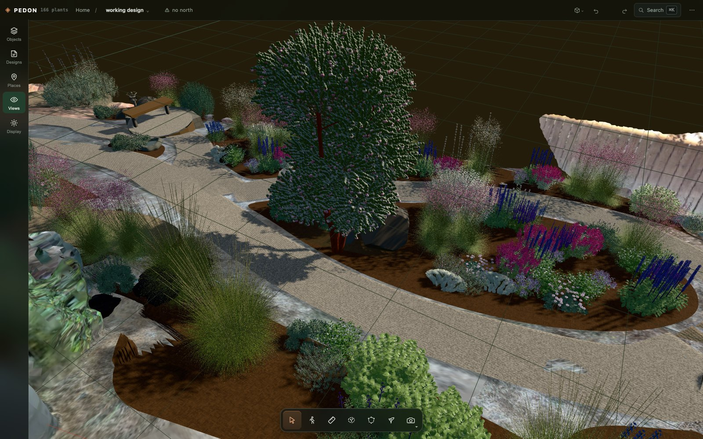
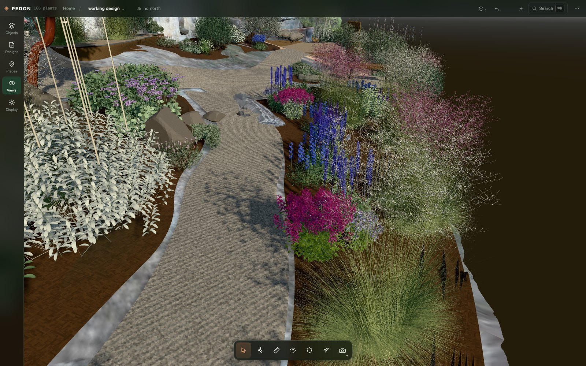

# PEDON

**An AI designs your garden — and makes what the design needs — on a measured scan of the real
ground.**

PEDON turns a phone scan of a garden into a measured 3D site. An AI model — Claude Code or
Codex — designs on it with you, and when the design calls for something PEDON has never drawn,
a stone basin, a trellis, a species of its own, the AI finds or builds the 3D model itself.
Every change is checked against the ground, in metres, and the result comes out as drawings you
can plant from and as the design standing at true size on your phone.



*A real garden designed in PEDON, in full detail. Its plant models were made by the AI along the way
and live in the owner's library; a fresh install draws plants with a generic generator until
yours has its own.*

*pedon, n. — the smallest volume of earth that can be called a soil.*

## An AI that designs, and makes what the design needs

PEDON ships no 3D model files and no stock photographs. It ships **skills** —
the method a garden designer works by ([`DESIGNING.md`](pedon/DESIGNING.md)) and how to make a
3D model look like the real thing ([`ASSET_FIDELITY.md`](pedon/ASSET_FIDELITY.md)) — and the
**tools** to act on them. With those, the AI:

- **designs** — agrees the idea, a precedent, a colour concept and the seasons with you, then
  details it: it measures the ground before it proposes, looks at its own work from your
  viewpoints, and every change it makes goes through the same validator as yours;
- **finds a 3D model** for an object or a plant — in your library, among the built-in kinds, or
  in [Poly Haven](https://polyhaven.com)'s free CC0 models — and brings it in, converted,
  standing on the ground, its licence on its card;
- **makes one when nothing fits** — it writes a Blender script (run in a sandbox with no network
  and no file writes), gets back a picture of the result, and fixes the script until the model
  looks right: a lantern, a boulder, a plant species at its mature size;
- **draws a species from photographs** — it fetches reference photographs from Wikimedia
  Commons, with their licences, and writes a species builder: code that draws that one plant,
  leaf and flower, the way the photographs show it.

Everything it makes goes into **your library** (`~/PEDON/library`), shared by all your sites and
yours to keep, each item recording where it came from.



## What it does

- **A measured site from a phone scan.** Load a mesh (`.glb`) or a Gaussian splat (`.ply`,
  `.spz`) from a scanning app such as Scaniverse, set the ground level and north, and PEDON
  surveys it: slopes, the flat pockets, the areas around the house, where the sun falls through
  the year.
- **Design in conversation.** Open Claude Code or Codex in this repository and ask for a
  planting. PEDON's site tools let the agent look from your viewpoints, ask the ground's height
  and slope, check a path's grade and measure its own plan before it proposes anything, and its
  changes appear in the viewer as it makes them.
- **Or design by hand.** Add plants and objects, draw beds and paths, drag with snapping or type
  an exact distance, save variants, walk through at eye level, and see the sun and shadows at
  any date and hour.
- **Checked the same way every time.** Every change, by hand or by a model, goes through one
  validator. What the ground or building code makes impossible is refused — a path too steep to
  walk, a retaining wall too tall, two plants in one hole. Taste — spacing, density, composition
  — is measured and reported, never overruled.
- **From design to planting.** Print a planting plan at 1:50, a plant schedule and a
  setting-out table that finds every plant by tape from your own landmarks. Or use the [PEDON iPhone app](pedon/ios/README.md) to align the design with the original
  scan and see it on site at full size. Its planting guide marks each planting center; select
  one for a translucent mature plant preview and its recorded details.
- **Photoreal views** with Blender Cycles, at the real sun (optional).
- **Nothing leaves your computer that you did not send.** No AI API keys: the AI runs on the
  Claude Code or Codex subscription you are already logged in to, and your sites and
  everything made for them live in folders you own.

## Quick start

You need **Node 20+**, **Python 3.9+** and a browser. Optional: **Claude Code** or **Codex**
to design in conversation, and **Blender 4.x** for photoreal renders and making 3D models.

```bash
git clone https://github.com/FelisAI/pedon.git
cd pedon
pip install -r pedon/requirements.txt       # a virtual environment is a good idea
cd pedon/viewer
npm install
npm run dev                                 # http://localhost:5178
```

Open <http://localhost:5178> and choose **Open the demo garden**: a small sloping garden with a
house, a patio, a path and a planted bed, made by code and ready to design in. Or start your
own site on the same screen.

## Using PEDON

### Your own site

Name the site on the first screen (or later in **··· → Project settings → New project…**) and
follow its setup path. The top bar says what is left:

1. **Load the capture** — the scan file; it is copied into the site.
2. **Fit the ground**, then **set north** — until north is set, every bearing is the scanner's.
3. **Lock the scale** — keep the capture's own, or check it against a taped distance.
4. **Survey the ground** — slopes, zones around the house, the gentle pockets.
5. **Look up the address** — climate zone and the building outline (US addresses).

Then mark what matters in **Places**: landmarks, the areas you draw, and the viewpoints you
design from — a window, the back door, a bench. These are yours; nothing generates them, and
designs are judged from them.

The address lookup uses public records (the US Census geocoder and Overture building
footprints); with `GOOGLE_MAPS_API_KEY` set it also reads roof planes from Google's Solar API.
From a shell, `python3 pedon/tools/project.py new "Oak Lane" --open` starts a site,
`… demo --open` opens the demo garden and `… list` lists your sites.

### Designing with an AI agent

Keep the viewer running with its page open in a browser tab — the agent looks through it. Then,
in another terminal:

```bash
cd pedon && claude      # Claude Code: allow the project's "yardeye" tools when it asks
cd pedon && codex       # Codex: trust the folder when it asks — it reads the tools' settings
                        # (.codex/config.toml) only in a folder you have trusted
```

Ask in your own words — *"a drought-tolerant planting for the sunny bank, looking good from the
back door all year"*. The agent reads `AGENTS.md` and the design method
([`pedon/DESIGNING.md`](pedon/DESIGNING.md)), talks the idea through with you, then works on
the site: every change goes through the validator and shows in the viewer within a second.
Any species can be planted — the agent states its mature size. Plants you research and keep go
into your library's catalogue, with their sources ([`pedon/docs/library.md`](pedon/docs/library.md)).

A design run can also be handed off whole: `python3 pedon/tools/agent.py "…"`
([`pedon/docs/design-agent.md`](pedon/docs/design-agent.md)).

### Designing by hand

The toolbar at the bottom selects, walks, measures, draws areas and adds plants and objects;
the rail on the left holds Objects, Designs, Places, Views and Display (the sun's date and hour,
Fast or full detail). **⌘K** finds any command. Drag an object with its gizmo, and type a
distance while dragging to move it exactly. **Designs** saves and switches variants.

### Planting it

- **··· → Planting drawings to print…** — select the beds you are planting first; the plan,
  schedule and setting-out sheets open ready to print at 100%.
- **··· → See it on site…** — makes the AR file from the design on screen. Open the phone door
  in that sheet (it is shut until you do), then enter the displayed address in the
  [PEDON iPhone app](pedon/ios/README.md). The app is built from source with Xcode;
  it is the only supported way to overlay a design on the real site.

## How it is organised

PEDON keeps three things apart:

| | where | what |
| --- | --- | --- |
| **the app** | this repository | code, tools, validators, docs — no assets and no site |
| **your library** | `~/PEDON/library` (`PEDON_LIBRARY` moves it) | what is made or fetched along the way, shared by every site: plant and object models, textures, reference photos, the plant catalogue, species builders — each saying where it came from |
| **your sites** | `~/PEDON/<site>/` (`PEDON_PROJECTS` moves them) | one folder per site: its scan, its ground truth (`site.json`), the working design and its saved variants |

A fresh install starts with an empty library, and that works: plants are drawn by a generic
generator and trees by code until your library has models of its own. `pedon/docs/` has the
detail — [`site.md`](pedon/docs/site.md), [`viewer.md`](pedon/docs/viewer.md),
[`plants.md`](pedon/docs/plants.md), [`rendering.md`](pedon/docs/rendering.md),
[`planting-out.md`](pedon/docs/planting-out.md), [`tools.md`](pedon/docs/tools.md) — and
[`AGENTS.md`](AGENTS.md) is the index, for people and coding agents alike.

## Tests

```bash
python3 pedon/tools/selftest.py
```

The Python and viewer suites together, in about two minutes, with no viewer running and no
network. They run against a small fixture library; tests about a real measured site skip until
you name one in `PEDON_TEST_SITE`.

## Contributing

See [`CONTRIBUTING.md`](CONTRIBUTING.md), and [`SECURITY.md`](SECURITY.md) to report a
vulnerability.

## Licence

PEDON is free software under the GNU Affero General Public License, version 3 only
([`LICENSE`](LICENSE)). Use it, study it, change it and share it; a changed version you share,
or run for other people over a network, comes with its source under the same licence.
